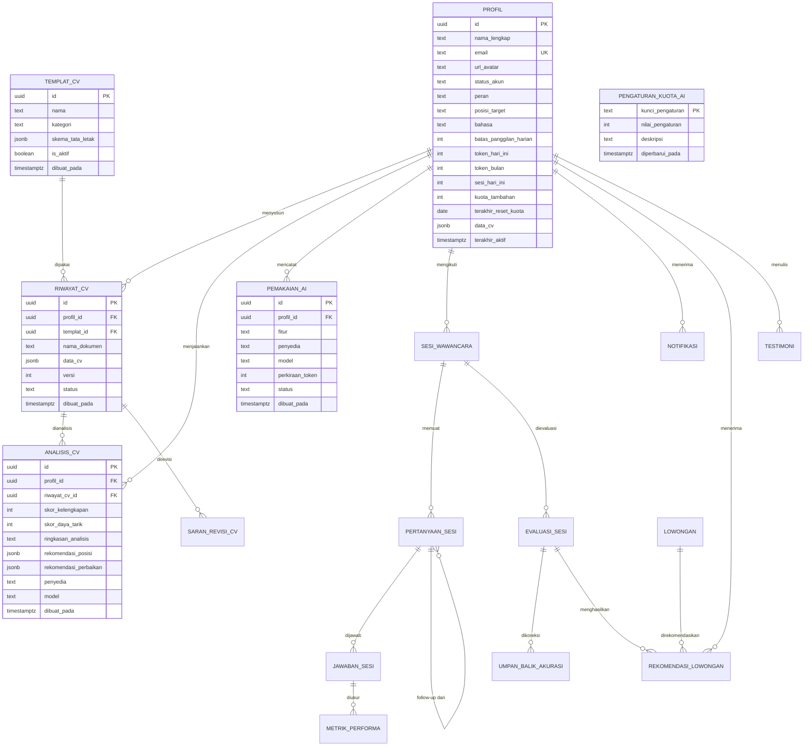

# database.md — Perancangan & Skema Database — MENTERVU AI

| Atribut | Nilai |
|---|---|
| **DBMS** | PostgreSQL 17 (Supabase) |
| **Status dokumen** | Draft v0.1 |
| **Terakhir diperbarui** | 2026-09-06 |
| **Dokumen terkait** | [`prd.md`](prd.md) • [`struktur_file.md`](struktur_file.md) • [`AGENTS.md`](AGENTS.md) |

> ⚙️ Dokumen ini memuat **entitas, relasi, RLS, dan kuota AI**. Selalu disinkronkan dengan `prd.md` (*apa*) dan `struktur_file.md` (*di mana*). Lihat [§13](#13-peta-keterkaitan--sinkronisasi).

---

## 1. Tujuan & Konvensi

1. Skema ditulis sebagai **target** — diterapkan bertahap lewat migrasi di `supabase/migrasi/` (§11).
2. Semua **nama tabel & kolom = Bahasa Indonesia, `snake_case`, tunggal**.
3. Setiap tabel memiliki `dibuat_pada` & `diperbarui_pada` (timestamptz, default `now()`).
4. **RLS aktif di semua tabel** yang menyimpan data pengguna (§8).
5. Data dinamis/disar AI memakai `jsonb` (NFR-13) — contoh `data_cv`, `rekomendasi_perbaikan`.

## 2. Prinsip Skema

- **Pemisahan data & logika:** backend FastAPI menulis via service key; frontend memakai klien anon + RLS.
- **Audit:** semua entitas inti menyimpan `dibuat_pada`/`diperbarui_pada` (trigger `perbarui_waktu`).
- **Soft-delete:** penghapusan memakai kolom status/`dihapus_pada` (nullable), bukan `DELETE` fisik, kecuali data transien.
- **Pencatatan AI:** setiap panggilan LLM Wajib terekam di `pemakaian_ai` (melalui `pengawas_kuota`).
- **Konvensi tanggal:** UTC (`timestamptz`); perbandingan kuota harian memakai `current_date` (server timezone dicatat di pengaturan).

## 3. Peta Nama Lama → Baru (Migrasi 001)

Tabel lama di project Supabase masih berbahasa campuran Inggris/Indonesia. `001_konversi_penamaan_indonesia.sql` melakukan `RENAME` (data aman, tidak ada duplikasi).

| Tabel lama (saat ini) | → Tabel baru | Status pakai |
|---|---|---|
| `profiles` | `profil` | M1 |
| `interview_sessions` | `sesi_wawancara` | M3 |
| `question_bank` | `bank_pertanyaan` | M3 |
| `cv_templates` | `templat_cv` | M1 |
| `cv_analysis_results` | `analisis_cv` | M1 |
| `ai_logs` | `pemakaian_ai` | M1 |
| `ai_quota_settings` | `pengaturan_kuota_ai` | M1 |
| `system_settings` | `pengaturan_sistem` | M1 |
| `landing_settings` | `pengaturan_landing` | CMS |
| `testimonials` | `testimoni` | CMS |
| `product_images` | `gambar_produk` | CMS |
| `visitor_analytics` | `analitik_pengunjung` | admin |
| `site_visits` | `kunjungan_situs` | admin |

Kolom `profiles.*` ikut di-*rename* (contoh): `full_name→nama_lengkap`, `avatar_url→url_avatar`, `account_status→status_akun`, `target_position→posisi_target`, `token_today→token_hari_ini`, `token_month→token_bulan`, `sessions_today→sesi_hari_ini`, `quota_override→kuota_tambahan`, `created_at→dibuat_pada`, `updated_at→diperbarui_pada`, `dob→tanggal_lahir`, `city→kota`, `last_active→terakhir_aktif`.
---

## 4. ERD (Entity Relationship Diagram)



> ERD menampilkan seluruh entitas (incl. fase M3–M5). Detail kolom: §5.

---

## 5. Daftar Tabel

> `RLS` = kebijakan (ringkas); detail policy di §8. Kolom `dibuat_pada`/`diperbarui_pada` default `now()`.

### 5.1 `profil` — Profil Pengguna (M1) — `models/profil.py`

Dipakai FR-01, FR-02, FR-19 (`prd.md` §6). Kolom yang ditandai **⊕** ditambahkan migrasi 002/003.

| Kolom | Tipe | Keterangan |
|---|---|---|
| `id` | uuid PK | = `auth.users.id` (FK ke `auth.users`) |
| `nama_lengkap` | text | dari `full_name` |
| `email` | text | unique |
| `url_avatar` | text nullable | dari `avatar_url`; sumber: Supabase Storage |
| `status_akun` | text | enum: `aktif`, `dinonaktifkan`, `diblokir` (dari `account_status`) |
| `peran` | text ⊕ | enum: `pengguna`, `admin`; default `pengguna` |
| `posisi_target` | text nullable | dari `target_position` |
| `bahasa` | text | `id` default / `en` (dari `language`) |
| `batas_panggilan_harian` | int ⊕ | **default 20** — kuota AI harian (§9) |
| `token_hari_ini` | int | pemakaian panggilan hari ini (dari `token_today`); reset harian |
| `token_bulan` | int | akumulasi bulan berjalan (dari `token_month`; dipertahankan) |
| `sesi_hari_ini` | int | dari `sessions_today` |
| `kuota_tambahan` | int nullable | override admin (± jumlah) dari `quota_override` |
| `terakhir_reset_kuota` | date ⊕ | tanggal reset terakhir (lazy reset §9) |
| `terakhir_aktif` | timestamptz nullable | dari `last_active` |
| `data_cv` | jsonb nullable | **didepresiasi** → `riwayat_cv.data_cv`; dipertahankan untuk rollback |
| `tanggal_lahir`, `gender`, `kota`, `telepon` | date/text | dari `dob`, `gender`, `city`, `phone` |
| `dibuat_pada`, `diperbarui_pada` | timestamptz | audit |

**RLS:** `SELECT/UPDATE` → `id = auth.uid()`; `INSERT` via trigger `buat_profil_otomatis` (diperbolehkan utk sistem).

### 5.2 `riwayat_cv` — Dokumen CV & Versi (M1, tabel baru) — `models/riwayat_cv.py`

Dipakai FR-04, FR-05, FR-08 (`prd.md` §6). Daftar CV di Home & PembuatCv membaca tabel ini.

| Kolom | Tipe | Keterangan |
|---|---|---|
| `id` | uuid PK | default `gen_random_uuid()` |
| `profil_id` | uuid FK → `profil.id` | pemilik |
| `templat_id` | uuid FK → `templat_cv.id` nullable | template terpilih |
| `nama_dokumen` | text | judul CV (contoh "CV Raihan – Frontend") |
| `data_cv` | jsonb | seluruh isi CV (biodata, ringkasan, pengalaman, pendidikan, keahlian, proyek, dll) — struktur dinamis (NFR-13); **field foto disimpan terpisah/unset di kolom ini** |
| `versi` | int | mulai 1; naik saat "Simpan sebagai versi baru" |
| `status` | text | enum: `aktif`, `arsip`, `dihapus` |
| `dibuat_pada`, `diperbarui_pada` | timestamptz | audit |

**RLS:** `SELECT/UPDATE/DELETE(→status)` → `profil_id = auth.uid()`.

### 5.3 `analisis_cv` — Hasil Analisis CV AI (M1) — `models/analisis_cv.py`

Dipakai FR-06, FR-19 (`prd.md` §6, §9). Kolom **sesuai struktur JSON prompt ATS** (`prd.md` §9).

| Kolom | Tipe | Keterangan |
|---|---|---|
| `id` | uuid PK | default `gen_random_uuid()` |
| `profil_id` | uuid FK → `profil.id` | pemilik |
| `riwayat_cv_id` | uuid FK → `riwayat_cv.id` nullable | CV yang dianalisis (untuk caching: bila CV ini belum berubah → pakai hasil lama) |
| `skor_kelengkapan` | int 0–100 | ↔ prompt `skor_kelengkapan` |
| `skor_daya_tarik` | int 0–100 | ↔ prompt `skor_daya_tarik` |
| `ringkasan_analisis` | text nullable | dari `brief_evaluation` (fase M4 dipakai untuk kesenjangan) |
| `rekomendasi_posisi` | jsonb | array string; ↔ prompt `rekomendasi_posisi[]` |
| `rekomendasi_perbaikan` | jsonb | `{ "tambah": [], "perbaiki": [], "hapus": [] }`; ↔ prompt |
| `penyedia` | text nullable | `google_1` / `google_2` / `openrouter` |
| `model` | text nullable | model yang menjawab |
| `perkiraan_token` | int | dari `pemakaian_ai` |
| `status` | text | enum: `berhasil`, `diproses`, `gagal` |
| `dibuat_pada` | timestamptz | urutkan desc untuk "terbaru" |

**RLS:** `SELECT/INSERT` → `profil_id = auth.uid()` (insert boleh user agar frontend langsung dapat via klien anon; pencatatan akhir tetap via backend).

### 5.4 `templat_cv`, `pemakaian_ai`, `pengaturan_kuota_ai`, `pengaturan_sistem` (M1)

**`templat_cv`** (dari `cv_templates`) — FR-05:
| Kolom | Tipe | Keterangan |
|---|---|---|
| `id` | uuid PK | seed 5 template: Profesional, Kreatif, Minimalis, Modern, Lulusan Baru |
| `nama` | text | nama template |
| `kategori` | text | kategori (mis. `umum`, `kreatif`, `lulusan_baru`) |
| `skema_tata_letak` | jsonb nullable | definisi layout/section untuk editor |
| `is_aktif` | bool | default `true` (dari `is_active`) |
| `penggunaan` | int | dari `usage_count`; analitik |
| `dibuat_pada`, `diperbarui_pada` | timestamptz | audit |

RLS: `SELECT` publik (template), `UPDATE` admin.

**`pemakaian_ai`** (dari `ai_logs`) — pencatatan wajib tiap panggilan LLM (FR-06; `struktur_file.md` §4):
| Kolom | Tipe | Keterangan |
|---|---|---|
| `id` | uuid PK | |
| `profil_id` | uuid FK → `profil.id` nullable | pemilik (null = sistem) |
| `fitur` | text | enum di bawah; contoh `analisis_cv`, `generate_pertanyaan`, `evaluasi_akhir` |
| `prompt` | text nullable | ringkasan prompt (bukan token besar penuh) |
| `respons` | text nullable | hasil (untuk debug admin) |
| `penyedia` | text | `google_1`/`google_2`/`openrouter` |
| `model` | text nullable | ⊕ kolom baru |
| `perkiraan_token` | int | dari `tokens_used` |
| `status` | text | `sukses`/`gagal`/(`diblokir_kuota`) |
| `dibuat_pada` | timestamptz | |

RLS: admin SELECT; user SELECT miliknya (opsional); INSERT sistem.

**`pengaturan_kuota_ai`** (dari `ai_quota_settings`) — FR-19, §9:
| Kolom | Tipe | Keterangan |
|---|---|---|
| `kunci_pengaturan` | text PK | dari `setting_key` |
| `nilai_pengaturan` | int | dari `setting_value` |
| `deskripsi` | text nullable | dari `description` |
| `diperbarui_pada` | timestamptz | |

Seed utama (⊕ = ditambah migrasi 002):
| kunci | nilai | fungsi |
|---|---|---|
| `kuota_harian_panggilan` ⊕ | **20** | batas panggilan AI/hari/user |
| `auto_switch` | 1 | fallback otomatis antar penyedia aktif |
| `default_quota_limit` | 10000 | (legacy, token; dipertahankan utk kompatibilitas) |
| `emergency_brake` | 0 | kill-switch seluruh AI |
| `google1_weekly_limit` | 300000 | limit mingguan akun 1 |
| `google2_weekly_limit` | 300000 | limit mingguan akun 2 |
| `openrouter_daily_limit` | 100000 | limit harian OpenRouter |

**`pengaturan_sistem`** (dari `system_settings`): key-value jsonb untuk konfigurasi aplikasi (mis. default mode simulasi `teks`, pengaturan consent kamera). RLS admin.

### 5.5 Tabel Fase Berikutnya (terencana, belum dibuat di M1)

| Tabel | FR | Kolom utama (ringkas) |
|---|---|---|
| `sesi_wawancara` | FR-09,10,22 | id, profil_id FK, mode (`teks/audio/video`), bahasa, posisi_target, status (`berlangsung/selesai/dibatalkan`), skor_total, tanggal_mulai, tanggal_selesai |
| `pertanyaan_sesi` | FR-10 | id, sesi_id FK, tipe (`inti/lanjutan`), pertanyaan, urutan, pertanyaan_induk_id FK (self, untuk follow-up), status (`terjawab/dilewati`) |
| `jawaban_sesi` | FR-10,13 | id, pertanyaan_sesi_id FK, teks_mentah, teks_terkoreksi (auto-correct), durasi (detik) |
| `metrik_performa` | FR-12 | id, jawaban_sesi_id FK, kontak_mata_persen, postur (`tegak/membungkuk`), durasi, skor_kepercayaan_diri |
| `evaluasi_sesi` | FR-12,13,14 | id, sesi_id FK, skor_verbal, skor_non_verbal, skor_total, rincian jsonb (rubrik per pertanyaan), rekomendasi_posisi jsonb |
| `umpan_balik_akurasi` | FR-13 | id, evaluasi_sesi_id FK, profil_id FK, kategori, catatan |
| `saran_revisi_cv` | FR-07,15 | id, analisis_cv_id FK, bagian (`ringkasan/pengalaman/keahlian/dll`), teks_asli, saran_ai, status (`menunggu/diterima/ditolak`) |
| `lowongan` | FR-16 | id, judul, perusahaan, lokasi, gaji_min/maks, tipe, url, sumber (JSearch), tanggal_publikasi, data_mentah jsonb |
| `rekomendasi_lowongan` | FR-17,18 | id, profil_id FK, lowongan_id FK, evaluasi_sesi_id FK nullable, skor_kecocokan, rincian_bobot jsonb (`skill/pengalaman/gaji/lokasi`) |
| `notifikasi` | FR-21 | id, profil_id FK, jenis, judul, isi, telah_dibaca, dibaca_pada, tautan |
| `testimoni`, `gambar_produk`, `analitik_pengunjung`, `kunjungan_situs`, `pengaturan_landing` | CMS | mengikuti struktur lama yang sudah ada (dari migrasi 001) |

---

## 6. Enum (didefinisikan sebagai `text` + `CHECK` untuk fleksibilitas NFR-13)

| Enum | Nilai |
|---|---|
| `status_akun` | `aktif`, `dinonaktifkan`, `diblokir` |
| `peran` | `pengguna`, `admin` |
| `status_cv` | `aktif`, `arsip`, `dihapus` |
| `status_analisis` | `berhasil`, `diproses`, `gagal` |
| `mode_sesi` | `teks`, `audio`, `video` |
| `status_sesi` | `berlangsung`, `selesai`, `dibatalkan` |
| `tipe_pertanyaan` | `inti`, `lanjutan` (follow-up) |
| `postur` | `tegak`, `membungkuk` |
| `status_saran` | `menunggu`, `diterima`, `ditolak` |
| `fitur_ai` | `analisis_cv`, `generate_pertanyaan`, `follow_up`, `auto_correct`, `evaluasi_akhir`, `pencocokan_lowongan` |
| `bahasa` | `id`, `en` |

## 7. Trigger & Fungsi

| Nama | Pemicu | Tindakan |
|---|---|---|
| `perbarui_waktu()` | `BEFORE UPDATE` pada tabel ber-`diperbarui_pada` | `diperbarui_pada = now()` |
| `buat_profil_otomatis()` | `AFTER INSERT ON auth.users` | menyisipkan baris `profil` (id=NEW.id) dengan status `aktif`, `bahasa='id'`, `batas_panggilan_harian=20` |
| `reset_kuota_harian()` | fungsi (dipanggil service `layanan_kuota`, bukan trigger timestamper) | bila `current_date > terakhir_reset_kuota` → set `token_hari_ini=0`, `terakhir_reset_kuota=current_date` |

## 8. Kebijakan RLS

Prinsip: **user hanya boleh membaca/mengubah data miliknya** (`auth.uid()`); backend server-side memakai service key (bisa melewati RLS). Frontend memakai klien anon.

| Tabel | Policy ringkas |
|---|---|
| `profil` | `SELECT/UPDATE` where `id = auth.uid()`; pelindung `peran` hanya bisa dibaca di sisi admin |
| `riwayat_cv` | `SELECT/UPDATE(soft)/INSERT` where `profil_id = auth.uid()` |
| `analisis_cv` | `SELECT/INSERT` where `profil_id = auth.uid()` |
| `templat_cv` | `SELECT` publik; `UPDATE/INSERT/DELETE` admin |
| `pemakaian_ai` | `SELECT` admin; `INSERT` sistem (service key) |
| `pengaturan_kuota_ai` | `SELECT` publik (nilai limit dibutuhkan UI); `UPDATE` admin |
| `pengaturan_sistem` | `SELECT` publik (subset); `UPDATE` admin |
| Tabel fase berikut (`sesi_wawancara`, dll) | pola sama: `profil_id`/`sesi → profil_id` = `auth.uid()` |

> Catatan: policy `profil` untuk kolom sensitif (email, token) dibatasi; detail implementasi di migrasi (bukan hardcode di dokumen agar mudah diubah).

## 9. Logika Kuota Harian 20 (Panggilan AI)

**Definisi:** 1 panggilan LLM = 1 hit. Batas default per user = 20/hari kalender (setting `kuota_harian_panggilan`), dapat dioverride per user via `profil.kuota_tambahan` (±).

```text
Panggil LLM (semua fitur AI)
  │
  ├─1─ Lazy reset: jika current_date > profil.terakhir_reset_kuota
  │        → token_hari_ini = 0 ; terakhir_reset_kuota = current_date
  │
  ├─2─ Hitung batas efektif = 20 + COALESCE(kuota_tambahan, 0)   [tidak boleh <0]
  │
  ├─3─ Jika token_hari_ini >= batas efektif → TOLAK (HTTP 429,
  │        pesan: "Kuota AI hari ini habis")   ← TIDAK menambah pemakaian
  │
  ├─4─ Kirim ke pengarah rute LLM (gemini1 → gemini2 → openrouter)
  │
  ├─5─ Sukses → token_hari_ini += 1 ; token_bulan += 1
  │        ; INSERT pemakaian_ai (fitur, penyedia, model, perkiraan_token, status)
  │
  └─6─ Gagal karena error penyedia (bukan kuota) → status 'gagal'
           DI CATAT di pemakaian_ai TANPA menambah token_hari_ini
           (agar kegagalan eksternal tidak menghabiskan kuota user)
```

**Ilustrasi:**
| Skenario | Hasil |
|---|---|
| User baru memakai 3 dari 20, lalu refresh → tetap 3 (lazy reset hanya saat tanggal berganti) |
| User memakai sampai 20 → panggilan ke-21 ditolak 429; UI menampilkan kartu "kuota habis" |
| Admin set `kuota_tambahan=5` → batas jadi 25 |
| Penyedia Gemini down → fallback OpenRouter sukses → dihitung 1; bila semua gagal → tidak menambah hit |

**Sinkron dokumen:** nilai `20` ≠ hanya di file ini — `prd.md` §8 & setting `kuota_harian_panggilan` (tabel ini) wajib sama.

---

## 10. Indeks yang Disarankan

```sql
-- performa Home & riwayat
CREATE INDEX idx_riwayat_cv_profil        ON public.riwayat_cv (profil_id, status);
CREATE INDEX idx_analisis_cv_profil_tgl   ON public.analisis_cv (profil_id, dibuat_pada DESC);
CREATE INDEX idx_pemakaian_ai_profil_tgl  ON public.pemakaian_ai (profil_id, dibuat_pada DESC);
CREATE INDEX idx_sesi_profil_tgl          ON public.sesi_wawancara (profil_id, dibuat_pada DESC);
```

## 11. Urutan Migrasi & Isi (file di `supabase/migrasi/`)

| # | File | Eksekusi | Isi inti |
|---|---|---|---|
| 001 | `001_konversi_penamaan_indonesia.sql` | saat mulai M1 | `RENAME TABLE` (13 tabel) + `RENAME COLUMN` `profil`; update trigger/constraint ke nama baru |
| 002 | `002_kuota_harian_20.sql` | saat mulai M1 | `profil.batas_panggilan_harian` default 20, `profil.terakhir_reset_kuota`, `peran`; seed `kuota_harian_panggilan=20` di `pengaturan_kuota_ai`; perbaiki `handle_new_user()` |
| 003 | `003_entitas_milestone_1.sql` | saat mulai M1 | bikin `riwayat_cv`; tambah kolom `analisis_cv` (skor_kelengkapan, skor_daya_tarik, rekomendasi_perbaikan, riwayat_cv_id, penyedia, model, status); rename `templat_cv` (5 template Indonesia); trigger `perbarui_waktu`, `reset_kuota_harian`; RLS `riwayat_cv`; indeks |
| 004 | `004_penyimpanan_foto.sql` | saat mulai M1 | bucket Storage `foto-profil` (publik) + kebijakan RLS per-uid `{uid}/avatar.*` |
| 005 | `005_perbaikan_status_akun.sql` | saat mulai M1 | default & nilai `status_akun` → `aktif` + CHECK enum Indonesia |
| 004+ | (fase berikut) | M3–M5 | `sesi_wawancara`, `pertanyaan_sesi`, `jawaban_sesi`, `metrik_performa`, `evaluasi_sesi`, `saran_revisi_cv`, `lowongan`, `notifikasi`, dll |

> ⚠️ `000_*`-seed & migrasi lama di dashboard Supabase (quota, RLS admin, testimoni) **dibiarkan/tidak dihapus**; migrasi baru menyesuaikan (rename) — dokumentasikan setiap penyimpangan di kolom "Catatan".

## 12. Contoh Kueri Utama

```sql
-- Sisa kuota hari ini (Home)
SELECT (p.batas_panggilan_harian + COALESCE(p.kuota_tambahan,0)) AS batas,
       p.token_hari_ini AS terpakai,
       GREATEST(0, p.batas_panggilan_harian + COALESCE(p.kuota_tambahan,0) - p.token_hari_ini) AS sisa
FROM public.profil p WHERE p.id = auth.uid();

-- Analisis CV terbaru user
SELECT * FROM public.analisis_cv
WHERE profil_id = auth.uid()
ORDER BY dibuat_pada DESC LIMIT 1;

-- Daftar CV aktif
SELECT * FROM public.riwayat_cv
WHERE profil_id = auth.uid() AND status = 'aktif'
ORDER BY diperbarui_pada DESC;

-- Validasi nilai kuota global
SELECT nilai_pengaturan FROM public.pengaturan_kuota_ai
WHERE kunci_pengaturan = 'kuota_harian_panggilan';
```

## 13. Peta Keterkaitan & Sinkronisasi

- **`database.md` → `struktur_file.md`:** setiap tabel = 1 file di `models/`; endpoint barisnya tercantum di `struktur_file.md` §7.
- **`database.md` → `prd.md`:** kolom "Data" di tabel FR (§6 `prd.md`) merujuk ke tabel di dokumen ini; prompt JSON (`prd.md` §9) ↔ kolom `analisis_cv` (§5.3).
- **Aturan:** tambah/ubah tabel atau kolom → (1) tulis migrasi baru di `supabase/migrasi/`, (2) perbarui §5 + §11 di file ini, (3) tambahkan model/controller di `struktur_file.md`, (4) jika menyentuh fitur, perbarui `prd.md` (FR + kolom "Data").
- **Kuota:** nilai `20` tersimpan di `pengaturan_kuota_ai.kuota_harian_panggilan`; jangan di-hardcode terpisah di backend — baca dari DB (fallback default 20) dan jaga agar `prd.md` §8 tetap sinkron.